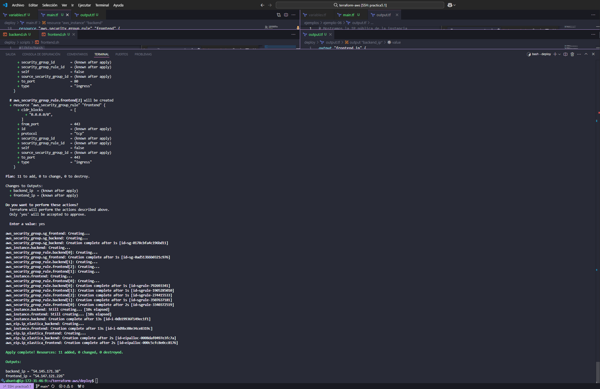
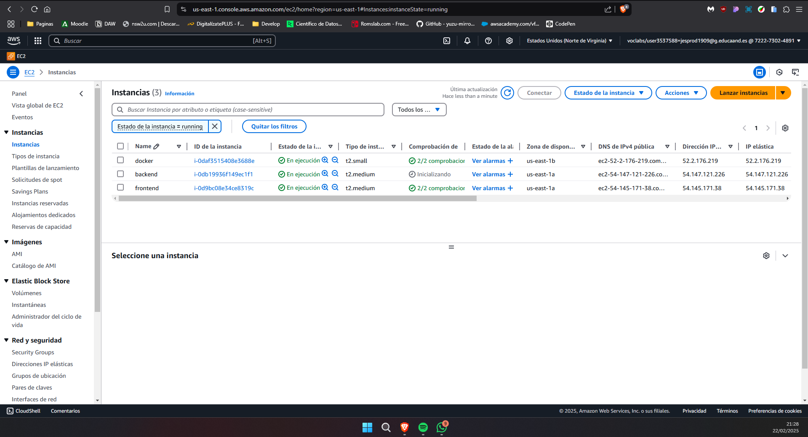

# Práctica: Configuración de Infraestructura en AWS con Terraform

Este repositorio contiene una práctica en la que se utiliza **Terraform** para configurar y desplegar infraestructura en **AWS**. La práctica consiste en la creación de dos instancias EC2 (una para el frontend y otra para el backend), junto con la configuración de grupos de seguridad, reglas de entrada y direcciones IP elásticas.

## Descripción del Proyecto

El objetivo de esta práctica es automatizar la creación de una infraestructura básica en AWS utilizando Terraform. Se configuran los siguientes recursos:

1. **Grupos de seguridad**: Se crean dos grupos de seguridad, uno para el frontend y otro para el backend, con reglas de entrada (ingress) personalizadas.
2. **Instancias EC2**: Se despliegan dos instancias EC2, una para el frontend y otra para el backend, asociadas a sus respectivos grupos de seguridad.
3. **Direcciones IP elásticas**: Se asignan direcciones IP elásticas a las instancias para permitir el acceso público.
4. **Scripts de configuración**: Se utilizan scripts de usuario (`user_data`) para configurar las instancias al iniciarse.

## Estructura del Código

El código de Terraform está organizado de la siguiente manera:

- **Proveedor de AWS**: Se configura el proveedor de AWS con la región especificada.
- **Grupos de seguridad**: Se definen dos grupos de seguridad (`sg_frontend` y `sg_backend`) con reglas de entrada dinámicas basadas en listas de puertos.
- **Instancias EC2**: Se crean dos instancias EC2 (`frontend` y `backend`) con AMI, tipo de instancia y claves SSH personalizables.
- **Direcciones IP elásticas**: Se asignan IPs elásticas a las instancias y se muestran como salidas.
- **Variables**: Se utilizan variables para parametrizar la configuración, como la región, puertos, AMI, tipo de instancia, etc.

## Configuración Requerida

Antes de ejecutar el código, asegúrate de tener lo siguiente:

1. **Terraform instalado**: Descarga e instala Terraform desde [aquí](https://www.terraform.io/downloads.html).
2. **Credenciales de AWS**: Configura tus credenciales de AWS utilizando el archivo `~/.aws/credentials` o variables de entorno.
3. **Clave SSH**: Asegúrate de tener una clave SSH válida en AWS para acceder a las instancias.

## Uso

1. Clona este repositorio:
   ```bash
   git clone <url-del-repositorio>
   cd <directorio-del-repositorio>

2. Inicializa Terraform:
   ```bash
    terraform init
    ```
3. Revisa los recursos que se van a crear:
    ```bash
     terraform plan
     ```
4. Aplica los cambios para crear la infraestructura:
    ```bash
    terraform apply
    ```
5. Al terminar, puedes destruir la infraestructura:
    ```bash
    terraform destroy
    ```
6. Al crear la infraestructura, se mostrarán las direcciones IP elásticas asignadas a las instancias.





## Variables Personalizables

Las siguientes variables pueden ser modificadas en el archivo `variables.tf.

- **region**: Región de AWS donde se desplegarán los recursos (por defecto: `us-east-1`).
- **ports_frontend**: Lista de puertos abiertos para el frontend (por defecto: `[22, 80, 443]`).
- **ports_backend**: Lista de puertos abiertos para el backend (por defecto: `[22, 3306]`).
- **ami_id**: ID de la AMI utilizada para las instancias (por defecto: `ami-00874d747dde814fa`).
- **instance_type**: Tipo de instancia EC2 (por defecto: `t2.medium`).
- **key_name**: Nombre de la clave SSH (por defecto: `vockey`).
- **instance_frontend_name**: Nombre de la instancia frontend (por defecto: `frontend`).
- **instance_backend_name**: Nombre de la instancia backend (por defecto: `backend`).

## Salidas

Después de aplicar la configuración, Terraform mostrará las siguientes salidas:

- **frontend_ip**: Dirección IP pública de la instancia frontend.
- **backend_ip**: Dirección IP pública de la instancia backend.

## Scripts de Usuario

Se utilizan dos scripts de usuario para configurar las instancias al iniciarse:

- **frontend.sh**: Script para configurar la instancia frontend.
- **backend.sh**: Script para configurar la instancia backend.

Estos scripts deben estar ubicados en el directorio `./scripts/`.